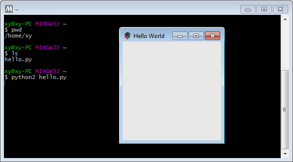
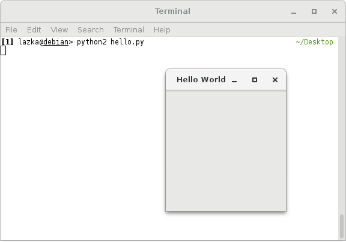
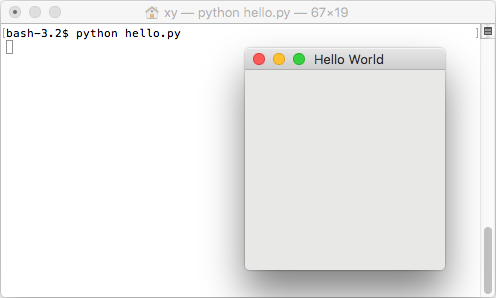

.. include:: icons.rst

.. _gettingstarted:

===============
Getting Started
===============

To get things started we will try to run a very simple `GTK
<https://www.gtk.org/>`_ based GUI application using the :doc:`PyGObject <index>` provided
Python bindings. First create a small Python script called ``hello.py`` with
the following content and save it somewhere:

.. code:: python

    import sys

    import gi

    gi.require_version("Gtk", "4.0")
    from gi.repository import GLib, Gtk

    class MyApplication(Gtk.Application):
        def __init__(self):
            super().__init__(application_id="com.example.MyGtkApplication")
            GLib.set_application_name('My Gtk Application')

        def do_activate(self):
            window = Gtk.ApplicationWindow(application=self, title="Hello World")
            window.present()

    app = MyApplication()
    exit_status = app.run(sys.argv)
    sys.exit(exit_status)

Before we can run the example application we need to install PyGObject, GTK
and their dependencies. Follow the instructions for your platform below.

For full IDE support (incl. autocomplete) you will also need typing stubs available here `PyGObject-stubs <https://pypi.org/project/PyGObject-stubs/>`_.

======================================================= ==================================================== ==========================================================
|ubuntu-logo| :ref:`Ubuntu <ubuntu-getting-started>`    |fedora-logo| :ref:`Fedora <fedora-getting-started>` |arch-logo| :ref:`Arch Linux <arch-getting-started>`
|windows-logo| :ref:`Windows <windows-getting-started>` |macosx-logo| :ref:`macOS <macosx-getting-started>`  |opensuse-logo| :ref:`openSUSE <opensuse-getting-started>`
======================================================= ==================================================== ==========================================================

After running the example application have a look at the :doc:`/tutorials/index` for an overview of how to create GTK apps and the `GNOME Python API docs
<https://api.pygobject.gnome.org/>`__ for API documentation for all supported
libraries.

.. _windows-getting-started:

|windows-logo| Windows
----------------------

#) Go to https://www.msys2.org/ and download the x86_64 installer
#) Follow the instructions on the page for setting up the basic environment
#) Run ``C:\msys64\ucrt64.exe`` - a terminal window should pop up
#) Execute ``pacman -Suy``
#) Execute ``pacman -S mingw-w64-ucrt-x86_64-gtk4 mingw-w64-ucrt-x86_64-python3 mingw-w64-ucrt-x86_64-python3-gobject``
#) To test that GTK is working you can run ``gtk4-demo``
#) Copy the ``hello.py`` script you created to ``C:\msys64\home\<username>``
#) In the mingw32 terminal execute ``python3 hello.py`` - a window should appear.

.. _ubuntu-getting-started:

|ubuntu-logo| Ubuntu / |debian-logo| Debian
-------------------------------------------

Installing the system provided PyGObject:
  #) Open a terminal
  #) Execute ``sudo apt install python3-gi python3-gi-cairo gir1.2-gtk-4.0``
  #) Change the directory to where your ``hello.py`` script can be found (e.g. ``cd Desktop``)
  #) Run ``python3 hello.py``

Installing from PyPI with pip:
  #) Open a terminal and enter your virtual environment
  #) Execute ``sudo apt install libgirepository-2.0-dev gcc libcairo2-dev pkg-config python3-dev gir1.2-gtk-4.0``
     to install the build dependencies and GTK
  #) Execute ``pip3 install pycairo`` to build and install Pycairo
  #) Execute ``pip3 install PyGObject`` to build and install PyGObject
  #) Change the working directory to where your ``hello.py`` script can be found
  #) Run ``python3 hello.py``

.. _fedora-getting-started:

|fedora-logo| Fedora
--------------------

Installing the system provided PyGObject:
  #) Open a terminal
  #) Execute ``sudo dnf install python3-gobject gtk4``
  #) Change the working directory to where your ``hello.py`` script can be found
  #) Run ``python3 hello.py``

Installing from PyPI with pip:
  #) Open a terminal and enter your virtual environment
  #) Execute ``sudo dnf install gcc gobject-introspection-devel cairo-gobject-devel pkg-config python3-devel gtk4``
     to install the build dependencies and GTK
  #) Execute ``pip3 install pycairo`` to build and install Pycairo
  #) Execute ``pip3 install PyGObject`` to build and install PyGObject
  #) Change the working directory to where your ``hello.py`` script can be found
  #) Run ``python3 hello.py``

.. _arch-getting-started:

|arch-logo| Arch Linux
----------------------

Installing the system provided PyGObject:
  #) Open a terminal
  #) Execute ``sudo pacman -S python-gobject gtk4``
  #) Change the working directory to where your ``hello.py`` script can be found
  #) Run ``python3 hello.py``

Installing from PyPI with pip:
  #) Open a terminal and enter your virtual environment
  #) Execute ``sudo pacman -S python cairo pkgconf gobject-introspection gtk4``
     to install the build dependencies and GTK
  #) Execute ``pip3 install pycairo`` to build and install Pycairo
  #) Execute ``pip3 install PyGObject`` to build and install PyGObject
  #) Change the working directory to where your ``hello.py`` script can be found
  #) Run ``python3 hello.py``

.. _opensuse-getting-started:

|opensuse-logo| openSUSE
------------------------

Installing the system provided PyGObject:
  #) Open a terminal
  #) Execute ``sudo zypper install python3-gobject python3-gobject-Gdk typelib-1_0-Gtk-4_0 libgtk-4-1``
  #) Change the directory to where your ``hello.py`` script can be found
  #) Run ``python3 hello.py``

Installing from PyPI with pip:
  #) Open a terminal and enter your virtual environment
  #) Execute ``sudo zypper install cairo-devel pkg-config python3-devel gcc gobject-introspection-devel``
     to install the build dependencies and GTK
  #) Execute ``pip3 install pycairo`` to build and install Pycairo
  #) Execute ``pip3 install PyGObject`` to build and install PyGObject
  #) Change the working directory to where your ``hello.py`` script can be found
  #) Run ``python3 hello.py``

.. _macosx-getting-started:

|macosx-logo| macOS
-------------------

#) Go to https://brew.sh/ and install homebrew
#) Open a terminal
#) Execute ``brew install pygobject3 gtk4``
#) Change the working directory to where your ``hello.py`` script can be found
#) Run ``python3 hello.py``

----

For more details on how to use a virtualenv with PyGObject, see the
":ref:`devenv`" page.

.. toctree::
    :hidden:
    :maxdepth: 1

    changelog
    bugs_repo
