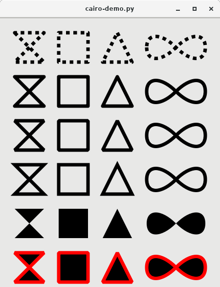

=================
Cairo Integration
=================

Despite `cairo <https://cairographics.org/>`__ not being a GObject based
library, PyGObject provides special cairo integration through `pycairo
<https://pycairo.readthedocs.io>`__. Functions returning and taking cairo data
types get automatically converted to pycairo objects and vice versa.

Some distros ship the PyGObject cairo support in a separate package. If you've
followed the instructions on ":ref:`gettingstarted`" you should have everything
installed.

If your application requires the cairo integration you can use
:func:`gi.require_foreign`:

.. code:: python

    try:
        gi.require_foreign("cairo")
    except ImportError:
        print("No pycairo integration :(")

Note that PyGObject currently does not support `cairocffi
<https://pypi.org/pypi/cairocffi>`__, only pycairo.

Demo
----

The following example shows a :obj:`Gtk.Window` with a custom drawing in Python
using pycairo.

.. literalinclude:: code/cairo-demo.py
    :linenos:
