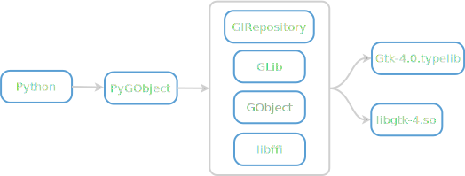

.. include:: icons.rst

.. title:: Overview

.. toctree::
    :hidden:
    :titlesonly:
    :maxdepth: 1

    getting_started
    tutorials/index
    guide/index
    devguide/index
    contact

.. image:: images/pygobject.svg
   :align: center
   :width: 400px
   :height: 98px
   :class: only-light

|

.. include:: ../README.rst
    :start-after: |
    :end-before: ----

If you want to write a Python application for `GNOME
<https://www.gnome.org/>`__ or a Python GUI application using GTK, then
PyGObject is the way to go. To get started, check out the "`GNOME Developer Documentation
<https://developer.gnome.org/documentation/tutorials/beginners.html>`__". For more
information on specific libraries, check out the
`GNOME Python API documentation <https://api.pygobject.gnome.org/>`__.

.. code:: python

    import sys

    import gi

    gi.require_version("Gtk", "4.0")
    from gi.repository import GLib, Gtk

    class MyApplication(Gtk.Application):
        def __init__(self):
            super().__init__(application_id="com.example.MyGtkApplication")
            GLib.set_application_name("My Gtk Application")

        def do_activate(self):
            window = Gtk.ApplicationWindow(application=self, title="Hello World")
            window.present()

    app = MyApplication()
    exit_status = app.run(sys.argv)
    sys.exit(exit_status)

How does it work?
-----------------

.. figure:: images/overview.svg
    :width: 600px
    :height: 222px
    :align: center
    :class: only-light

PyGObject uses `GLib <https://docs.gtk.org/glib/>`__, `GObject
<https://docs.gtk.org/gobject/>`__, `GIRepository
<https://docs.gtk.org/girepository/>`__, `libffi
<https://sourceware.org/libffi/>`__ and other libraries to access the C
library (libgtk-4.so) in combination with the additional metadata from the
accompanying typelib file (Gtk-4.0.typelib) and dynamically provides a Python
interface based on that information.

Who Is Using PyGObject?
-----------------------

* `Anaconda <https://fedoraproject.org/wiki/Anaconda>`__ - an installation program used by Fedora, RHEL and others
* `Apostrophe <https://apps.gnome.org/Apostrophe/>`__ - a Markdown editor
* `Blanket <https://apps.gnome.org/Blanket/>`__ - listen to different sounds
* `BleachBit <https://www.bleachbit.org/>`__ - delete unnecessary files from the system
* `Bottles <https://usebottles.com/>`__ - run Windows software on Linux
* `Cambalache <https://gitlab.gnome.org/jpu/cambalache>`__ - a user interface maker for GTK
* `Cozy <https://github.com/geigi/cozy>`__ - the audiobook app for Linux
* `D-Feet <https://wiki.gnome.org/action/show/Apps/DFeet>`__ - an easy to use D-Bus debugger
* `Deluge <https://deluge-torrent.org/>`__ - a BitTorrent client
* `Dialect <https://apps.gnome.org/Dialect/>`__ - a translation app
* `Drawing <https://maoschanz.github.io/drawing/>`__ - a drawing application
* `Feeds <https://gfeeds.gabmus.org/>`__ - an RSS/Atom feed reader
* `Gajim <https://gajim.org/>`__ - a fully-featured XMPP client
* `Gameeky <https://github.com/tchx84/gameeky>`__ - a learning tool for making games and learning experiences
* `Gaphor <https://gaphor.org/>`__ - a simple modeling tool
* `Getting Things GNOME! <https://wiki.gnome.org/Apps/GTG>`__ - a personal task organizer
* `Girens <https://gitlab.gnome.org/tijder/girens>`__ - a Plex client for playing movies, TV shows and music from your Plex library
* `GNOME Music <https://apps.gnome.org/Music/>`__ - a music player for GNOME
* `GNOME Tweaks <https://wiki.gnome.org/Apps/Tweaks>`__ - a tool to customize advanced GNOME options
* `Gramps <https://gramps-project.org/>`__ - a genealogy program
* `Komikku <https://valos.gitlab.io/Komikku/>`__ - a manga reader
* `Lollypop <https://wiki.gnome.org/Apps/Lollypop>`__ - a modern music player
* `Lutris <https://lutris.net/>`__ - a video game manager
* `Meld <https://meldmerge.org/>`__ - a visual diff and merge tool
* `Metadata Cleaner <https://apps.gnome.org/MetadataCleaner/>`__ - an application to view and clean metadata in files
* `MyPaint <https://mypaint.app/>`__ - a nimble, distraction-free, and easy tool for digital painters
* `Nicotine+ <https://nicotine-plus.org/>`__ - a graphical client for the Soulseek peer-to-peer network
* `Orca <https://wiki.gnome.org/Projects/Orca>`__ - a flexible and extensible screen reader
* `Paperwork <https://openpaper.work/>`__ - a personal document manager
* `Pithos <https://pithos.github.io/>`__ - a Pandora Radio client
* `Pitivi <https://www.pitivi.org/>`__ - a free and open source video editor
* `Plots <https://github.com/alexhuntley/Plots/>`__ - a graph plotting app
* `Quod Libet <https://quodlibet.readthedocs.io/>`__ - a music library manager / player
* `Secrets <https://apps.gnome.org/Secrets/>`__ - a password manager
* `Setzer <https://www.cvfosammmm.org/setzer/>`__ - a LaTeX editor
* `Terminator <https://gnome-terminator.org/>`__ - The Robot Future of Terminals
* `Wike <https://hugolabe.github.io/Wike/>`__ - a Wikipedia reader

The following applications or libraries use PyGObject for optional features,
such as plugins or as optional backends:

* `beets <https://beets.io/>`__ - a music library manager and MusicBrainz tagger
* `gedit <https://wiki.gnome.org/Apps/Gedit>`_- a GNOME text editor
* `matplotlib <https://matplotlib.org/>`__ - a python 2D plotting library
* `Totem <https://wiki.gnome.org/Apps/Videos>`__ - a video player for GNOME

Further Resources
-----------------

`GNOME Developer Documentation <https://developer.gnome.org/documentation/tutorials/beginners.html>`__
    Tutorials for creating a GNOME application using PyGObject, GTK 4, and Libadwaita.

`GNOME Python API documentation <https://api.pygobject.gnome.org/>`__
    Auto generated API documentation for many libraries accessible through
    PyGObject.
