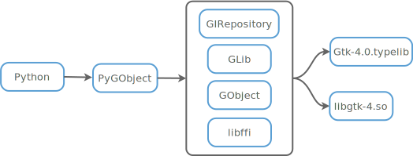

.. include:: icons.rst

.. title:: Overview

.. toctree::
    :hidden:
    :titlesonly:
    :maxdepth: 1

    getting_started
    changelog
    bugs_repo
    guide/index
    devguide/index
    packagingguide
    maintguide
    further
    contact

.. image:: images/pygobject.svg
   :align: center
   :width: 400px
   :height: 98px

|

.. include:: ../README.rst
    :start-after: |
    :end-before: ----

If you want to write a Python application for `GNOME
<https://www.gnome.org/>`__ or a Python GUI application using GTK+, then
PyGObject is the way to go. For more information on specific libraries check
out the "`Python GTK+ 3 Tutorial
<https://python-gtk-3-tutorial.readthedocs.io>`__" and the "`Python GI API
Reference <https://lazka.github.io/pgi-docs>`__".

.. code:: python

    import gi
    gi.require_version("Gtk", "3.0")
    from gi.repository import Gtk

    window = Gtk.Window(title="Hello World")
    window.show()
    window.connect("destroy", Gtk.main_quit)
    Gtk.main()

How does it work?
-----------------

PyGObject uses `glib <https://developer.gnome.org/glib/stable/>`__, `gobject
<https://developer.gnome.org/gobject/stable/>`__, `girepository
<https://developer.gnome.org/gi/stable/>`__, `libffi
<https://sourceware.org/libffi/>`__ and other libraries to access the C
library (libgtk-3.so) in combination with the additional metadata from the
accompanying typelib file (Gtk-3.0.typelib) and dynamically provides a Python
interface based on that information.

Who Is Using PyGObject?
-----------------------

* `Anaconda <https://fedoraproject.org/wiki/Anaconda>`__ - an installation program used by Fedora, RHEL and others
* `D-Feet <https://wiki.gnome.org/action/show/Apps/DFeet>`__ - an easy to use D-Bus debugger
* `GNOME Music <https://wiki.gnome.org/Apps/Music>`__ - a music player for GNOME
* `GNOME Tweak Tool <https://wiki.gnome.org/action/show/Apps/GnomeTweakTool>`__ - a tool to customize advanced GNOME 3 options
* `Gramps <https://gramps-project.org/>`__ - a genealogy program
* `Lollypop <https://gnumdk.github.io/lollypop-web/>`__ - a modern music player
* `Meld <http://meldmerge.org/>`__ - a visual diff and merge tool
* `MyPaint <http://mypaint.org/>`__ - a nimble, distraction-free, and easy tool for digital painters
* `Orca <https://wiki.gnome.org/Projects/Orca>`__ - a flexible and extensible screen reader
* `Pithos <https://pithos.github.io/>`__ - a Pandora Radio client
* `Pitivi <http://www.pitivi.org/>`__ - a free and open source video editor
* `Quod Libet <https://quodlibet.readthedocs.io/>`__ - a music library manager / player
* `Transmageddon <http://www.linuxrising.org/>`__ - a video transcoder

The following applications or libraries use PyGObject for optional features,
such as plugins or as optional backends:

* `beets <http://beets.io/>`__ - a music library manager and MusicBrainz tagger
* `gedit <https://wiki.gnome.org/Apps/Gedit>`_- a GNOME text editor
* `matplotlib <http://matplotlib.org/>`__ - a python 2D plotting library
* `Totem <https://wiki.gnome.org/Apps/Videos>`__ - a video player for GNOME
