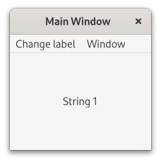

.. currentmodule:: gi.repository

Application
===========

.. seealso::

    For more detailed information about ``Gtk.Application`` checkout the
    :devdocs:`Using GtkApplication <tutorials/application>` tutorial.

:class:`Gtk.Application` is the foundation for creating GTK apps. It encompasses
many repetitive tasks that a modern application needs such as handling multiple
instances, D-Bus activation, opening files, command line parsing,
startup/shutdown, menu management, window management, and more.

In this example we will be also using :class:`Gtk.ApplicationWindow`, it
provides some extra features over regular :class:`Gtk.Window` for main
application windows.

Actions
-------

:class:`Gio.Action` is a way to expose any single task your application or widget
does by a name. These actions can be disabled/enabled at runtime and they can
either be activated or have a state changed (if they contain state).

The reason to use actions is to separate out the logic from the UI. For example
this allows using a menubar on OSX and a gear menu on GNOME both simply
referencing the name of an action. On the main implementation of this, what you will
be using is :class:`Gio.SimpleAction`, which will be demonstrated later.

Many classes such as :class:`Gio.MenuItem` and :class:`Gtk.Actionable` interface
implementations like :class:`Gtk.Button` support properties to set an action
name.

These actions can be grouped together into a :class:`Gio.ActionGroup` and
when these groups are added to a widget with :meth:`Gtk.Widget.insert_action_group()`
they will gain a prefix. Such as "win" when added to a :class:`Gtk.ApplicationWindow`.
You will use the full action name when referencing it such as "app.about" but when
you create the action it will just be "about" until added to the application.

You can also very easily make keybindings for actions by setting the `accel`
property in the :class:`Gio.Menu` file or by using :meth:`Gtk.Application.set_accels_for_action()`.

Menus
-----

Your menus should be defined in XML using :class:`Gio.Menu` and would reference
the previously mentioned actions you defined. :class:`Gtk.Application` allows you
to set a menu via :meth:`Gtk.Application.set_menubar()`. If you make use of :class:`Gio.Resource`
this can automatically load the menu, otherwise you can set them manually.
A detailed example is shown below.

Command Line
------------

When creating your application it takes a flag property of :class:`Gio.ApplicationFlags`.
Using this you can let it handle everything itself or have more custom behavior.

You can use ``HANDLES_COMMAND_LINE`` to allow custom behavior in :meth:`Gio.Application.do_command_line()`.
In combination with :meth:`Gio.Application.add_main_option()` to add custom options.

Using ``HANDLES_OPEN`` will do the work of simply taking file arguments for you and
let you handle it in :meth:`Gio.Application.do_open()`.

If your application is already open these will all be sent to the existing instance
unless you use ``NON_UNIQUE`` to allow multiple instances.

Example
-------

.. literalinclude:: examples/application.py
    :linenos:
