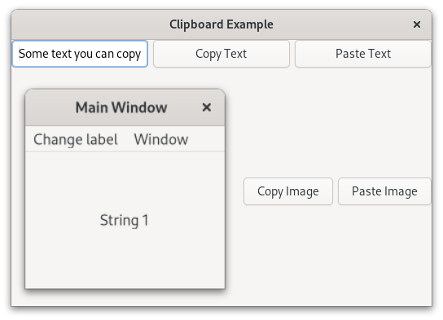

.. currentmodule:: gi.repository

Clipboard
=========

:class:`Gdk.Clipboard` provides a storage area for a variety of data, including
text and images. Using a clipboard allows this data to be shared between
applications through actions such as copying, cutting, and pasting.

There are multiple clipboard selections for different purposes.
In most circumstances, the selection named ``CLIPBOARD`` is used for everyday
copying and pasting. ``PRIMARY`` is another common selection which stores text
selected by the user with the cursor.

:class:`Gdk.Display` will allow us to access these different clipboards.
You can get the default display with :meth:`Gdk.Display.get_default`, then get
the clipboard that you want; :meth:`Gdk.Display.get_clipboard` for ``CLIPBOARD``
and :meth:`Gdk.Display.get_primary_clipboard` for ``PRIMARY``.

You can set any simple value like text with :meth:`Gdk.Clipboard.set`.
For more complex data you must use the :meth:`Gdk.Clipboard.set_content` method
were you have to pass a :class:`Gdk.ContentProvider`.
A content provider is usually created using
:meth:`Gdk.ContentProvider.new_for_value` where you only pass the value.

To read the clipboard values :class:`Gdk.Clipboard` provides three async methods.
For textual or image data use :meth:`Gdk.Clipboard.read_text_async` or
:meth:`Gdk.Clipboard.read_texture_async`.
For other data use :meth:`Gdk.Clipboard.read_value_async`.

Example
-------

.. literalinclude:: examples/clipboard.py
    :linenos:
