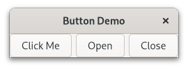
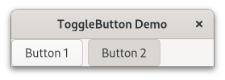
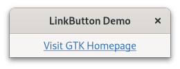

.. currentmodule:: gi.repository

Buttons
=======

Button
------
The Button widget is another commonly used widget. It is generally used to
attach a function that is called when the button is pressed.

The :class:`Gtk.Button` widget can hold any valid child widget. That is it can
hold most any other standard :class:`Gtk.Widget`.
The most commonly used child is the :class:`Gtk.Label`.
Normally you will use :attr:`Gtk.Button.props.label` to set the button label, or
:attr:`Gtk.Button.props.icon_name` if you want an icon instead.

Usually, you want to connect to the button's ``clicked`` signal which is emitted
when the button has been pressed and released.

Example
^^^^^^^

.. literalinclude:: examples/button.py
    :linenos:

ToggleButton
------------

A :class:`Gtk.ToggleButton` is very similar to a normal :class:`Gtk.Button`,
but when clicked they remain activated, or pressed, until clicked again.
When the state of the button is changed, the `toggled` signal is emitted.

To retrieve the state of the :class:`Gtk.ToggleButton`, you can use
:attr:`Gtk.ToggleButton.props.active`. This returns ``True`` if the button
is "down". You can also set the toggle button's state, with
:attr:`Gtk.ToggleButton.props.active`. Note that, if you do this, and the state
actually changes, it causes the "toggled" signal to be emitted.

Example
^^^^^^^

.. literalinclude:: examples/togglebutton.py
    :linenos:

LinkButton
----------
A :class:`Gtk.LinkButton` is a :class:`Gtk.Button` with a hyperlink, similar
to the one used by web browsers, which triggers an action when clicked. It is
useful to show quick links to resources.

The URI bound to a :class:`Gtk.LinkButton` can be set specifically using
:attr:`Gtk.LinkButton.props.uri`.

Example
^^^^^^^

.. literalinclude:: examples/linkbutton.py
    :linenos:
