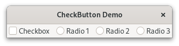

Check & Radio Buttons
=====================
A  :class:`Gtk.CheckButton` places a label next to an indicator.
Check or Radio buttons are created through :class:`Gtk.CheckButton`, you create
one or another depending grouping.

:class:`Gtk.CheckButton` can be grouped together, to form mutually exclusive
groups so only one of the buttons can be toggled at a time, this create what we
usually refer to as a radio button.

In addition to "on" and "off", :class:`Gtk.CheckButton` can be an "in between"
state that is neither on nor off. This can be used e.g. when the user has
selected a range of elements (such as some text or spreadsheet cells) that are
affected by a check button, and the current values in that range are
inconsistent.
For this purpose use :attr:`Gtk.CheckButton.props.inconsistent`.

Example
-------

.. literalinclude:: examples/check_radio_buttons.py
    :linenos:
