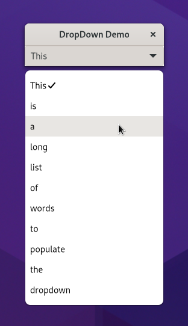

.. currentmodule:: gi.repository

DropDown
========
:class:`Gtk.DropDown` allows the user to choose an item from a list of options.
They are preferable to having many radio buttons on screen as they take up less
room.

To populate its options :class:`Gtk.DropDown` uses a :class:`Gio.ListModel`.
:class:`Gio.ListModel` it's an interface that represents a mutable list of
:class:`GObject.Objects <GObject.Object>`. For text-only uses cases GTK provides
:class:`Gtk.StringList`, a list model that wraps an array of strings wrapped on
:class:`Gtk.StringObject` and :class:`Gtk.DropDown` knows how to use it.

:class:`Gtk.DropDown` can optionally allow search in the popup, which is useful
if the list of options is long. To enable the search entry, use
:attr:`Gtk.DropDown.props.enable_search`.

.. attention::
    If you use custom list models with custom gobjects you must provide a
    :class:`Gtk.Expression` through :attr:`Gtk.DropDown.props.expression` so
    :class:`Gtk.DropDown` can know how to filter the gobjects.
    :class:`Gtk.Expression` has been supported in PyGObject since release 3.48.

:class:`Gtk.DropDown` stores the selected item from the list model in
:attr:`Gtk.DropDown.props.selected_item`, and the position of that item on
:attr:`Gtk.DropDown.props.selected`. To know when the selection has changed just
connect to ``notify::selected-item`` or ``notify::selected``.

Example
^^^^^^^

We are creating a simple :class:`Gtk.DropDown` using :class:`Gtk.StringList`.

.. literalinclude:: examples/dropdown.py
    :linenos:
