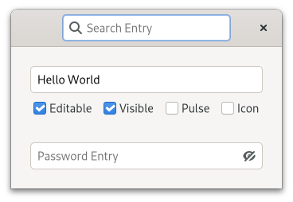

.. currentmodule:: gi.repository

Entries
=======

Entries allows the user to enter text.
GTK provides a few entry widgets for different use cases.
Those are the generic :class:`Gtk.Entry`, :class:`Gtk.PasswordEntry` and
:class:`Gtk.SearchEntry`.
Although none of these widgets derive from each other, they implement the
:class:`Gtk.Editable` :doc:`interface </tutorials/gobject/interfaces>`, so they share some
properties and methods.
You can change and get the contents with the :attr:`Gtk.Editable.props.text`
property.
You can also limit the number of characters the entry can take with
:attr:`Gtk.Editable.props.max_width_chars`.

Occasionally you might want to make an Entry widget read-only. This can be done
by setting :attr:`Gtk.Editable.props.editable` to ``False``.

Generic Entry
-------------

:class:`Gtk.Entry` is the standard entry.

:class:`Gtk.Entry` can be set to show a invisible character using
:attr:`Gtk.Entry.props.visibility` and :attr:`Gtk.Entry.props.invisible_char`,
this is useful to hide the text of the entry when it is used for example to
retrieve passwords.
Though :ref:`password-entry` exist for this specific use
case.

:class:`Gtk.Entry` has the ability to display progress or activity information
behind the text. This is similar to :class:`Gtk.ProgressBar` widget and is
commonly found in web browsers to indicate how much of a page download has been
completed. To make an entry display such information, use
:attr:`Gtk.Entry.props.progress_fraction`,
:attr:`Gtk.Entry.props.progress_pulse_step`, or :meth:`Gtk.Entry.progress_pulse`.

Additionally, a :class:`Gtk.Entry` can show icons at either side of the entry.
These icons can be activatable by clicking, can be set up as drag source and can
have tooltips.
To add an icon, use :meth:`Gtk.Entry.set_icon_from_icon_name` or one of the
various other properties and methods that set an icon from an icon name,
:class:`Gio.Icon`, or a :class:`Gdk.Paintable`.
To set a tooltip on an icon, use :meth:`Gtk.Entry.set_icon_tooltip_text` or the
corresponding function for markup.

Entries can have a placeholder text,
just use :attr:`Gtk.Entry.props.placeholder_text`.

.. _password-entry:

Password Entry
--------------

:class:`Gtk.PasswordEntry` brings some features for password handing.
It can show a button to toggle the visibility of the text if you set
:attr:`Gtk.PasswordEntry.props.show_peek_icon` to ``True``.

Search Entry
------------

:class:`Gtk.SearchEntry` is an entry specially designed for use as a search
entry.
:class:`Gtk.SearchEntry` allows you to implement the popular "type to search"
feature.
You can use :meth:`Gtk.SearchEntry.set_key_capture_widget` to set the parent
widget that will redirect its key events to the entry.

:class:`Gtk.SearchEntry` has the
:func:`search-changed <Gtk.SearchEntry.signals.search_changed>` signal, it
differs from :class:`Gtk.Editable`'s :func:`changed <Gtk.Editable.signals.changed>`
in the sense that it gets emitted after a short delay that you can configure
with :attr:`Gtk.SearchEntry.props.search_delay`.
This way you can get reactive searching without over loading your backend.

Example
-------

.. literalinclude:: examples/entries.py
    :linenos:
