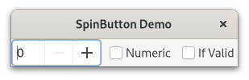

.. currentmodule:: gi.repository

SpinButton
==========
A :class:`Gtk.SpinButton` is an ideal way to allow the user to set the value of
some attribute. Rather than having to directly type a number into a
:class:`Gtk.Entry`, :class:`Gtk.SpinButton` allows the user to click on one of
two arrows to increment or decrement the displayed value. A value can still be
typed in, with the bonus that it can be checked to ensure it is in a given range.
The main properties of a :class:`Gtk.SpinButton` are set through
:class:`Gtk.Adjustment`.

To change the value that :class:`Gtk.SpinButton` is showing, use
:attr:`Gtk.SpinButton.props.value`. The value entered can either be an integer
or float, depending on your requirements, use
:meth:`Gtk.SpinButton.get_value_as_int` or :meth:`Gtk.SpinButton.get_value`,
respectively.

When you allow the displaying of float values in the spin button, you may wish
to adjust the number of decimal spaces displayed by calling
:attr:`Gtk.SpinButton.props.digits`.

By default, :class:`Gtk.SpinButton` accepts textual data. If you wish to limit
this to numerical values only, set :attr:`Gtk.SpinButton.props.numeric` to ``True``.

We can also adjust the update policy of :class:`Gtk.SpinButton`. There are two
options here; by default the spin button updates the value even if the data
entered is invalid. Alternatively, we can set the policy to only update when the
value entered is valid by changing :attr:`Gtk.SpinButton.props.update_policy` to
:attr:`Gtk.SpinButtonUpdatePolicy.IF_VALID`.

Example
^^^^^^^

.. literalinclude:: examples/spinbutton.py
    :linenos:
