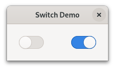

.. currentmodule:: gi.repository

Switch
======
A :class:`Gtk.Switch` is a widget that has two states: on or off. The user can
control which state should be active by clicking the empty area, or by dragging
the handle.

You shouldn't use the ``activate`` signal on the Gtk.Switch which is an action
signal and emitting it causes the switch to animate. Applications should never
connect to this signal, but use the ``notify::active`` signal, see the example
here below.

Example
^^^^^^^

.. literalinclude:: examples/switch.py
    :linenos:
