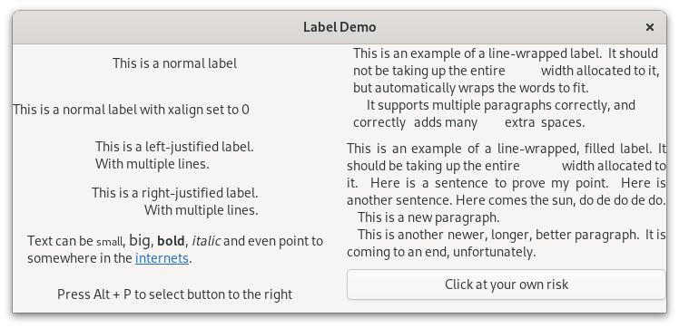

.. currentmodule:: gi.repository

Label
=====
Labels are the main method of placing non-editable text in windows, for instance
to place a title next to a :class:`Gtk.Entry` widget. You can specify the text
in the constructor, or later with the :attr:`Gtk.Label.props.label` property.

The width of the label will be adjusted automatically. You can produce
multi-line labels by putting line breaks (``\n``) in the label string.

Labels can be made selectable with :attr:`Gtk.Label.props.selectable`.
Selectable labels allow the user to copy the label contents to the
clipboard. Only labels that contain useful-to-copy information —
such as error messages — should be made selectable.

The label text can be justified using the :attr:`Gtk.Label.props.justify` prop.
The widget is also capable of word-wrapping, which can be activated with
:attr:`Gtk.Label.props.wrap`. You can configure this wrapping by changing
:attr:`Gtk.Label.props.wrap_mode`, in can be :attr:`Pango.WrapMode.WORD`,
:attr:`Pango.WrapMode.CHAR` or :attr:`Pango.WrapMode.WORD_CHAR`.

:class:`Gtk.Label` support some simple formatting, for instance allowing you to
make some text bold, colored, or larger. You can do this by enabling markup
setting :attr:`Gtk.Label.props.use_markup` to ``True``, then you can use markup
with :attr:`Gtk.Label.props.label` using the Pango Markup syntax [#pango]_.
For instance, ``<b>bold text</b> and <s>strikethrough text</s>``.
In addition, :class:`Gtk.Label` supports clickable hyperlinks.
The markup for links is borrowed from HTML, using the a with href and title
attributes. GTK renders links similar to the way they appear in web browsers,
with colored, underlined text. The title attribute is displayed as a tooltip
on the link. :meth:`Gtk.Label.set_markup` method can be used to set the text and
enable markup at the same time.

.. code-block:: python

    label.set_markup("Go to <a href=\"https://www.gtk.org\" "
                     "title=\"Our website\">GTK+ website</a> for more")

Labels may contain *mnemonics*. Mnemonics are underlined characters in the
label, used for keyboard navigation. Mnemonics are created by providing a
string with an underscore before the mnemonic character, such as "_File",
to the functions :meth:`Gtk.Label.new_with_mnemonic` or
:meth:`Gtk.Label.set_text_with_mnemonic`.
Mnemonics automatically activate any activatable widget the label is inside,
such as a :class:`Gtk.Button`; if the label is not inside the mnemonic's target
widget, you have to tell the label about the target using
:attr:`Gtk.Label.props.mnemonic_widget`.

You can also change the alignment of the label text inside its size allocation.
For example if you use :attr:`Gtk.Widget.props.hexpand` in a label, the label
may take more space than its inner text.
You can change this alignment using :attr:`Gtk.Label.props.xalign` for
horizontal alignment and :attr:`Gtk.Label.props.yalign` for vertical.

Example
-------

.. literalinclude:: examples/label.py
    :linenos:

.. [#pango] Pango Markup Syntax, https://docs.gtk.org/Pango/pango_markup.html
