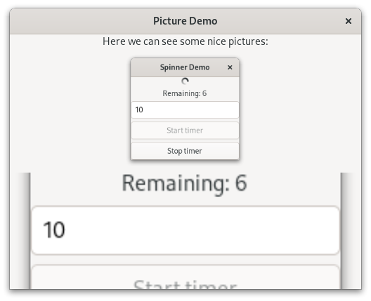

.. currentmodule:: gi.repository

Picture
=======

:class:`Gtk.Picture` displays an image at its natural size.
Many convenience functions are provided to make pictures simple to use.
For example, if you want to load an image from a file you can use
:meth:`Gtk.Picture.new_for_filename`.

You can influence how the image is displayed inside the :class:`Gtk.Picture` by
changing :attr:`Gtk.Picture.props.content_fit`. See :class:`Gtk.ContentFit` for
details.
Also :attr:`Gtk.Widget.props.halign` and :attr:`Gtk.Widget.props.valign` can be
used to set whether the picture will fill all available space or is displayed at its
original size.

Sometimes an application will want to avoid depending on external data files,
such as image files.
See the documentation of :class:`Gio.Resource` inside GIO, for details.
In this case, :meth:`Gtk.Picture.new_for_resource` and
:meth:`Gtk.Picture.set_resource`, should be used.

.. note:: This example requires a GTK version higher o equal to ``4.8``.

Example
-------

.. literalinclude:: examples/picture.py
    :linenos:
