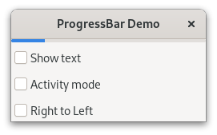

.. currentmodule:: gi.repository

ProgressBar
===========
The :class:`Gtk.ProgressBar` is typically used to display the progress of a
long running operation. It provides a visual clue that processing is underway.
The :class:`Gtk.ProgressBar` can be used in two different modes: *percentage
mode* and *activity mode*.

When an application can determine how much work needs to take place (e.g. read
a fixed number of bytes from a file) and can monitor its progress, it can use
the :class:`Gtk.ProgressBar` in *percentage mode* and the user sees a growing
bar indicating the percentage of the work that has been completed.
In this mode, the application is required to set
:attr:`Gtk.ProgressBar.props.fraction` periodically to update the progress bar,
setting a float between 0 and 1 to provide the new percentage value.

When an application has no accurate way of knowing the amount of work to do, it
can use *activity mode*, which shows activity by a block moving back and forth
within the progress area. In this mode, the application is required to call
:meth:`Gtk.ProgressBar.pulse` periodically to update the progress bar.
You can also choose the step size, with the
:attr:`Gtk.ProgressBar.props.pulse_step` property.

By default, :class:`Gtk.ProgressBar` is horizontal and left-to-right, but you
can change it to a vertical progress bar by changing the value of
:attr:`Gtk.ProgressBar.props.orientation <Gtk.Orientable.props.orientation>`.
Changing the direction the progress bar grows can be done using
:attr:`Gtk.ProgressBar.props.inverted`. :class:`Gtk.ProgressBar` can also
contain text which can be set with :attr:`Gtk.ProgressBar.props.text` and
:attr:`Gtk.ProgressBar.props.show_text`.

Example
-------

.. literalinclude:: examples/progressbar.py
    :linenos:
