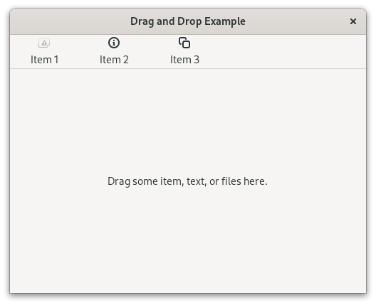

.. currentmodule:: gi.repository

Drag and Drop
=============

.. seealso:: `Drag-and-Drop`_ in the GTK documentation.

GTK drag-and-drop works with drag sources and drop targets.
These are event controllers that can be set to any widget using
:meth:`Gtk.Widget.add_controller`. The data begin moved in the operation is
provided through a :class:`Gdk.ContentProvider`.

Drag sources
------------
:class:`Gtk.DragSource` is the event controller that allows a widget to be used
as a drag source.
You can set up everything needed for the drag-and-drop operation ahead of time
or do it on the fly using the signals provided by :class:`Gtk.DragSource`.

You can use :meth:`Gtk.DragSource.set_content` to set the
:class:`Gdk.ContentProvider` that will be sent to drop targets.
A content provider is usually created using
:meth:`Gdk.ContentProvider.new_for_value` where you only pass the value to send.
To pass different values for multiple possible targets you can use
:meth:`Gdk.ContentProvider.new_union` were you can pass a list of
:class:`Gdk.ContentProviders <Gdk.ContentProvider>`.

:class:`Gtk.DragSource` provides signals for the different stages of the drag
event.
The :func:`prepare <Gtk.DragSource.signals.prepare>` signal is emitted when a
drag is about to be initiated, here you should return the
:class:`Gdk.ContentProvider` that will be sent, otherwise the one set with
:meth:`Gtk.DragSource.set_content` will be used.
The :func:`drag-begin <Gtk.DragSource.signals.drag_begin>` signal is emitted
when the drag is started, here you can do things like changing the icon attached
to the cursor when dragging using :meth:`Gtk.DragSource.set_icon`.
Also the :func:`drag-end <Gtk.DragSource.signals.drag_end>` signal is provided,
you can use it to undo things done in the previous signals.
Finally :func:`drag-cancel <Gtk.DragSource.signals.drag_cancel>` allows you
to do things when the operation has been cancelled.

Drop targets
------------
:class:`Gtk.DropTarget` is the event controller to receive drag-and-drop
operations in a widget.
When creating a new drop target with :meth:`Gtk.DropTarget.new` you should
provide the data type and :class:`Gdk.DragAction` that your target accepts.
If you want to support multiple data types you can pass :attr:`GObject.TYPE_NONE`
and then use :meth:`Gtk.DropTarget.set_gtypes` where you can pass a list of
types, be aware that the order of the list establish the priorities.

:class:`Gtk.DropTarget` provides multiple signals for the process. These are
:func:`accept <Gtk.DropTarget.signals.accept>`,
:func:`drop <Gtk.DropTarget.signals.drop>`,
:func:`enter <Gtk.DropTarget.signals.enter>`,
:func:`leave <Gtk.DropTarget.signals.leave>`, and
:func:`motion <Gtk.DropTarget.signals.motion>`.
Generally connecting to :func:`drop <Gtk.DropTarget.signals.drop>` is only
needed, this signal will receive the value sended by the :class:`Gtk.DragSource`.

For more complex use cases checkout :class:`Gtk.DropTargetAsync`.

Example
-------

.. literalinclude:: examples/drag_and_drop.py
    :linenos:

.. _Drag-and-Drop: https://docs.gtk.org/gtk4/drag-and-drop.html
