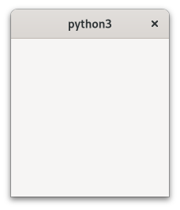
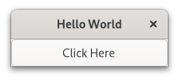

.. currentmodule:: gi.repository

Getting Started
===============

This section will give you a first contact with GTK, explaining each line of
code.

.. seealso:: `Getting Started with GTK`_ in the GTK documentation.

Basic Example
-------------

To start with our tutorial we create the simplest program possible.
This program will create an empty 200 x 200 pixel window.

.. literalinclude:: examples/simple_example.py
    :linenos:

We will now explain each line of the example.

.. literalinclude:: examples/simple_example.py
    :lines: 1-4

In the beginning, we have to import the Gtk module to be able to access GTK's
classes and functions.
Since a user's system can have multiple versions of GTK installed at the same,
we want to make sure that when we import Gtk that it refers to GTK4
and not any other version of the library, which is the purpose
of the statement ``gi.require_version('Gtk', '4.0')``.

.. literalinclude:: examples/simple_example.py
    :lines: 14-15

Now we create an application. The ``application_id`` argument is needed as
method of identifying your application to the system, if you do not know what
to set please :devdocs:`check this tutorial <tutorials/application-id>`.

We are also connecting to the application's ``activate`` event, where we will
create the window.

.. literalinclude:: examples/simple_example.py
    :lines: 7,9-10

In the ``on_activate`` callback we will create an empty window, and then display
it using the :meth:`Gtk.Window.present` method.

.. literalinclude:: examples/simple_example.py
    :lines: 18

Finally, we start the application using the :meth:`Gio.Application.run` method.

Minimal Example without GtkApplication
^^^^^^^^^^^^^^^^^^^^^^^^^^^^^^^^^^^^^^

In GTK 4, if you don't want to use :class:`Gtk.Application` you can use this
replacement that will iterate the default main loop until all windows have been
closed:

.. attention::
    Doing this is only useful for very specific use cases like tests. For app
    development you should always use :class:`Gtk.Application`.

.. code:: python

    import gi
    gi.require_version('Gtk', '4.0')
    from gi.repository import GLib, Gtk

    win = Gtk.Window()
    win.present()

    while (len(Gtk.Window.get_toplevels()) > 0):
        GLib.MainContext.default().iteration(True)

.. _extended-example:

Extended Example
----------------

For something a little more useful, here's the PyGObject version of the classic
"Hello World" program.

.. literalinclude:: examples/extended_example.py
    :linenos:

This example differs from the simple example as we sub-class
:class:`Gtk.ApplicationWindow` to define our own ``MyWindow`` class.

.. seealso::
    For more info about subclassing read
    :doc:`GObject Subclassing </tutorials/gobject/subclassing>`.

.. literalinclude:: examples/extended_example.py
    :lines: 7

In the class's constructor we have to call the constructor of the super class.
In addition, we tell it to set the value of the property title to *Hello World*.
Note that we are also receiving and passing ``**kargs``, so we can redirect
other arguments passed on ``MyWindow`` construction to the base class.

.. literalinclude:: examples/extended_example.py
    :lines: 8-9

The next three lines are used to create a button widget, connect to its
``clicked`` signal and add it as child to the top-level window.

.. literalinclude:: examples/extended_example.py
    :lines: 11-13

Accordingly, the method `on_button_clicked` will be called if you click on
the button. In this example we are using the method to print ``Hello World`` and
calling the window :meth:`Gtk.Window.close` method to close the window.

.. literalinclude:: examples/extended_example.py
    :lines: 15-17

The last block, outside of the class, is very similar to the simple example
above, but instead of creating an instance of the generic
:class:`Gtk.ApplicationWindow` or :class:`Gtk.Window` class, we create an
instance of ``MyWindow``.

.. _Getting Started with GTK: https://docs.gtk.org/gtk4/getting_started.html
