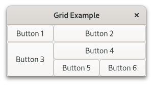
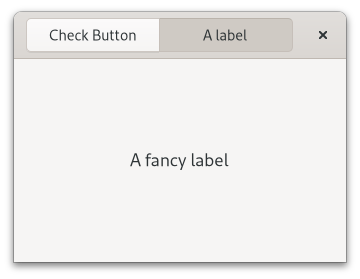
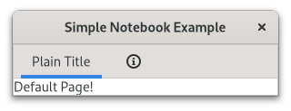

.. currentmodule:: gi.repository

Layout Containers
=================

While many GUI toolkits require you to precisely place widgets in a window,
using absolute positioning, GTK uses a different approach.
Rather than specifying the position and size of each widget in the window,
you can arrange your widgets in rows, columns, and/or tables.
The size of your window can be determined automatically, based on the sizes
of the widgets it contains.
And the sizes of the widgets are, in turn, determined by the amount of text
they contain, or the minimum and maximum sizes that you specify, and/or how
you have requested that the available space should be shared between sets of
widgets. You can perfect your layout by specifying padding distance and
centering values for each of your widgets. GTK then uses all this information
to resize and reposition everything sensibly and smoothly when the user
manipulates the window.

GTK widgets can parent other widgets hierarchically, and the way those widgets
are displayed depend on the :class:`Gtk.LayoutManager` set in the
:attr:`Gtk.Widget.props.layout_manager` property. For ease of use, GTK provides
"pre made" containers that have default layout managers for different needs.
Most of these containers implement the :class:`Gtk.Orientable` interface, it
allows to set the widget orientation using
:attr:`Gtk.Orientable.props.orientation`, you can either set
:attr:`Gtk.Orientation.HORIZONTAL` or :attr:`Gtk.Orientation.VERTICAL`.

Some containers / layout managers like :class:`Gtk.Box` allow you to influence
the allocation of a child using the :attr:`Gtk.Widget.props.halign`,
:attr:`Gtk.Widget.props.valign`, :attr:`Gtk.Widget.props.hexpand` and
:attr:`Gtk.Widget.props.vexpand` properties.

The main container widgets are:

* :class:`Gtk.Box`
* :class:`Gtk.CenterBox`
* :class:`Gtk.HeaderBar`
* :class:`Gtk.Grid`
* :class:`Gtk.ListBox`
* :class:`Gtk.FlowBox`
* :class:`Gtk.Stack`
* :class:`Gtk.Notebook`

We are looking into each one in the following sections.

Boxes
-----
Boxes are invisible containers into which we can pack our widgets.
When packing widgets into a horizontal box, the objects are inserted
horizontally from left to right or right to left depending on whether
:meth:`Gtk.Box.prepend` or :meth:`Gtk.Box.append` is used.
You can also use the :meth:`Gtk.Box.insert_child_after` or
:meth:`Gtk.Box.reorder_child_after` methods to insert a widget on a specific
position.
In a vertical box, widgets are packed from top to bottom or vice versa.
You may use any combination of boxes inside or beside other boxes to create
the desired effect.

Example
^^^^^^^

Let's take a look at a slightly modified version of
the :ref:`extended-example` with two buttons.

.. literalinclude:: examples/layout_box.py
    :linenos:

First, we create a horizontally orientated box container where 6 pixels are
placed between children. This box becomes the child of the top-level window.

.. literalinclude:: examples/layout_box.py
    :lines: 11-12

Subsequently, we add two different buttons to the box container.

.. literalinclude:: examples/layout_box.py
    :lines: 14-21

CenterBox
---------

:class:`Gtk.CenterBox` arranges three children in a row or a column depending on
its orientation, keeping the middle child centered as well as possible.

To add children you use :meth:`Gtk.CenterBox.set_start_widget`,
:meth:`Gtk.CenterBox.set_center_widget`, and :meth:`Gtk.CenterBox.set_end_widget`.

Example
^^^^^^^

.. literalinclude:: examples/layout_center.py
    :linenos:

HeaderBar
---------
A :class:`Gtk.HeaderBar` is similar to a horizontal :class:`Gtk.CenterBox`, it
allows to place children at the start or the end. In addition, it allows a title
to be displayed. The title will be centered with respect to the width of the box,
even if the children at either side take up different amounts of space.

:class:`Gtk.HeaderBar` is designed to be used as a window titlebar.
This means that it can show typical window frame controls, such as minimize,
maximize and close buttons, or the window icon.
It is also draggable, meaning that you can move the parent window from it.
You can use the :meth:`Gtk.Window.set_titlebar` method to set it as so.

To add children you use :meth:`Gtk.HeaderBar.pack_start`,
:meth:`Gtk.HeaderBar.pack_end`, and :meth:`Gtk.HeaderBar.set_title_widget` for
the center one. By default if no ``title_widget`` is set
it will have a label with the window's :attr:`Gtk.Window.props.title`.

Example
^^^^^^^

.. literalinclude:: examples/layout_headerbar.py
    :linenos:

Grid
----
:class:`Gtk.Grid` is a container which arranges its child widgets in rows and
columns, but you do not need to specify the dimensions in the constructor.
Children are added using :meth:`Gtk.Grid.attach`. They can span multiple rows or
columns. The :meth:`Gtk.Grid.attach` method takes five parameters:

1. The ``child`` parameter is the :class:`Gtk.Widget` to add.
2. ``left`` is the column number to attach the left side of ``child`` to.
3. ``top`` indicates the row number to attach the top side of ``child`` to.
4. ``width`` and ``height`` indicate the number of columns that the ``child``
   will span, and the number of rows that the ``child`` will span, respectively.

It is also possible to add a child next to an existing child, using
:meth:`Gtk.Grid.attach_next_to`, which also takes five parameters:

1. ``child`` is the :class:`Gtk.Widget` to add, as above.
2. ``sibling`` is an existing child widget of ``self`` (a :class:`Gtk.Grid` instance)
   or ``None``. The ``child`` widget will be placed next to ``sibling``, or
   if ``sibling`` is ``None``, at the beginning or end of the grid.
3. ``side`` is a :class:`Gtk.PositionType` indicating the side of
   ``sibling`` that ``child`` is positioned next to.
4. ``width`` and ``height`` indicate the number of columns and rows
   the ``child`` widget will span, respectively.

Example
^^^^^^^

.. literalinclude:: examples/layout_grid.py
    :linenos:

ListBox
-------

A :class:`Gtk.ListBox` is a vertical container that contains :class:`Gtk.ListBoxRow`
children. These rows can be dynamically sorted and filtered, and headers can be
added dynamically depending on the row content. It also allows keyboard and
mouse navigation and selection like a typical list.

Although a :class:`Gtk.ListBox` must have only :class:`Gtk.ListBoxRow` children,
you can add any kind of widget to it via :meth:`Gtk.ListBox.append` or
:meth:`Gtk.ListBox.insert` and a :class:`Gtk.ListBoxRow` widget will
automatically be inserted between the list and the widget.

:class:`Gtk.ListBox` allows activating and selecting its children.
Selection can be configured with :attr:`Gtk.ListBox.props.selection_mode`,
selection modes are :attr:`Gtk.SelectionMode.NONE` (not selection at all),
:attr:`Gtk.SelectionMode.SINGLE` (one or none elements can be selected),
:attr:`Gtk.SelectionMode.BROWSE` (user can't deselect a currently selected
element except by selecting another element) and
:attr:`Gtk.SelectionMode.MULTIPLE` (any number of elements may be selected).

It will emit the :func:`row-activated <Gtk.ListBox.signals.row_activated>`
signal when a row is activated in any form, and
:func:`row-selected <Gtk.ListBox.signals.row_selected>` when a row is selected.

Example
^^^^^^^

.. literalinclude:: examples/layout_listbox.py
    :linenos:

FlowBox
-------

A :class:`Gtk.FlowBox` is a container that positions child widgets in sequence
according to its orientation.

For instance, with the horizontal orientation, the widgets will be arranged
from left to right, starting a new row under the previous row when necessary.
Reducing the width in this case will require more rows, so a larger height
will be requested.

Likewise, with the vertical orientation, the widgets will be arranged from top
to bottom, starting a new column to the right when necessary. Reducing the
height will require more columns, so a larger width will be requested.

:class:`Gtk.FlowBox` behaves similar to :class:`Gtk.ListBox`, we could say that
is its "grid" counterpart. Just like :class:`Gtk.ListBox`, the children of a
:class:`Gtk.FlowBox` can be dynamically sorted and filtered, and also activated
and selected.

Although a :class:`Gtk.FlowBox` must have only :class:`Gtk.FlowBoxChild`
children, you can add any kind of widget to it via
:meth:`Gtk.FlowBox.append` or :meth:`Gtk.FlowBox.insert`, and a
:class:`Gtk.FlowBoxChild` widget will automatically be inserted between the box
and the widget.

Example
^^^^^^^

.. literalinclude:: examples/layout_flowbox.py
    :linenos:

Stack and StackSwitcher
-----------------------

A :class:`Gtk.Stack` is a container which only shows one of its children at a
time. In contrast to :class:`Gtk.Notebook`, :class:`Gtk.Stack` does not provide
a means for users to change the visible child. Instead, the
:class:`Gtk.StackSwitcher` widget can be used with :class:`Gtk.Stack` to
provide this functionality.

Transitions between pages can be animated as slides or fades. This can be
controlled with :attr:`Gtk.Stack.props.transition_type`. These animations
respect the ``gtk-enable-animations`` setting.

Transition speed can be adjusted with :attr:`Gtk.Stack.props.transition_duration`.

The :class:`Gtk.StackSwitcher` widget acts as a controller for a
:class:`Gtk.Stack`; it shows a row of buttons to switch between the various
pages of the associated stack widget.

:class:`Gtk.Stack` uses the auxiliary :class:`Gtk.StackPage` object.
:class:`Gtk.Stack` will return a :class:`Gtk.StackPage` every time you add a new
children, either with :meth:`Gtk.Stack.add_child`, :meth:`Gtk.Stack.add_named`
or :meth:`Gtk.Stack.add_titled`.
:class:`Gtk.StackPage` holds important properties for the stack's children, like
the name, the title to display, or if the page needs attention, then this data
can be used for example by :class:`Gtk.StackSwitcher`.

It is possible to associate multiple :class:`Gtk.StackSwitcher` widgets with
the same :class:`Gtk.Stack` widget.

Example
^^^^^^^

.. literalinclude:: examples/layout_stack.py
    :linenos:

Notebook
--------

The :class:`Gtk.Notebook` is a container whose children are pages switched
between using tabs.

There are many configuration options for GtkNotebook. Among other things, you
can choose on which edge the tabs appear (see :meth:`Gtk.Notebook.set_tab_pos`),
whether, if there are too many tabs to fit the notebook should be made bigger or
scrolling arrows added (see :meth:`Gtk.Notebook.set_scrollable`), and whether
there will be a popup menu allowing the users to switch pages (see
:meth:`Gtk.Notebook.popup_enable`, :meth:`Gtk.Notebook.popup_disable`).

You can add children with :meth:`Gtk.Notebook.append_page`, it takes two widgets,
the first is the widget to show as a page, and the second is the widget to show
as the tab content.

Example
^^^^^^^

.. literalinclude:: examples/layout_notebook.py
    :linenos:
