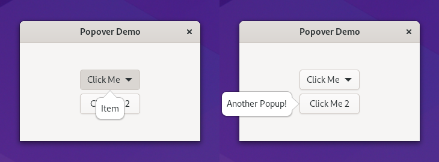
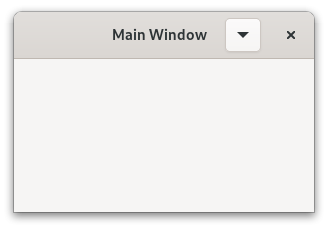

.. currentmodule:: gi.repository

Popovers
========

The :class:`Gtk.Popover` is an special kind of window used for displaying
additional information and is often used with button menus and context menus.
Popovers are attached to a parent widget and point to it.
It's position can be configured with :attr:`Gtk.Popover.props.position`.
:class:`Gtk.Popover` shows an arrow to visually connect where it points to,
this can be disabled setting :attr:`Gtk.Popover.props.has_arrow` to ``False``.

A :class:`Gtk.Popover` can be opened using :meth:`Gtk.Popover.popup` and hidden
with :meth:`Gtk.Widget.hide`.

GTK also provides :class:`Gtk.MenuButton`, it's an special button that can show
and hide a :class:`Gtk.Popover` attached to it using
:attr:`Gtk.MenuButton.props.popover`.

Custom Popover
--------------

A child widget can be added to a popover using :meth:`Gtk.Popover.set_child`.
The parent of the popover can be set using :meth:`Gtk.Widget.set_parent`.

Example
^^^^^^^

.. literalinclude:: examples/popover.py
    :linenos:

Menu Popover
------------

GTK also has :class:`Gtk.PopoverMenu`, it's a :class:`Gtk.Popover` subclass
designed to display a menu model.

A popover can be created from a :class:`Gio.MenuModel` using
:meth:`Gtk.PopoverMenu.new_from_model` and can be changed after creation with
:attr:`Gtk.PopoverMenu.props.menu_model`.

:class:`Gtk.MenuButton` also can construct a :class:`Gtk.PopoverMenu` passing it
a :class:`Gio.MenuModel` to :attr:`Gtk.MenuButton.props.menu_model`.

.. seealso::
    In :doc:`GTK Application </tutorials/gtk4/application>` we also showed examples of menu
    models.

Example
^^^^^^^

.. literalinclude:: examples/popover_menu.py
